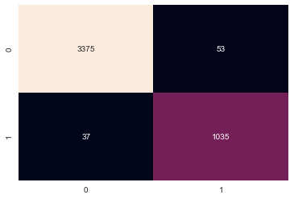

# Employee Quit Predictor : Project Overview

* Created a model to predict if an employer would leave a company based off some data provided to us by the HR department of the company

* Got a Test Accuracy of **99%**

* Used Drcision Trees as model, since problem was a Classification

___
### Code and Resources Used
* Python Version: 3.8
* Packages: pandas, numpy, matplotlib, seaborn, sklearn
* Dataset: [HR Analytics](kaggle.com/giripujar/hr-analytics)

___
### Features
* satisfaction_level
* last_evaluation
* number_project
* average_montly_hours
* time_spend_company
* Work_accident
* promotion_last_5years
* salary_code

### Target
* left
    * 0 - no
    * 1 - yes
___

### Model Building

I split the test and train set 70% and 30% respectively

I used **Decision Tree** as the algorithm for the model
___

### Model Performance
The model performed well with the following with the following metrics but had **53 False Positives** and **37 False Negatives**
* Test Accuracy - 98%

| Specie  | precision | recall  | 
|---------|-----------|---------|
| 0       | 0.99      | 0.98    | 
| 1       | 0.95      | 0.97    | 

* Confusion Matrix

